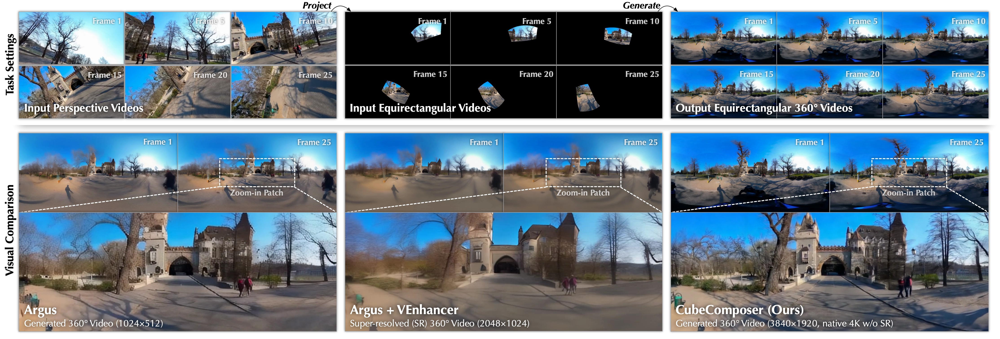
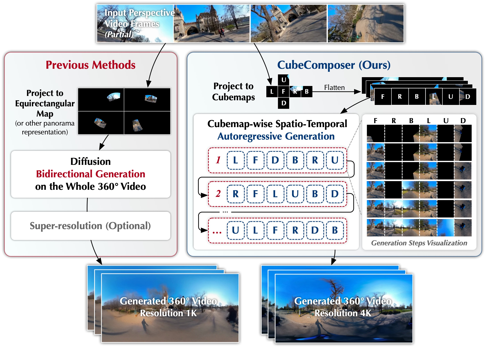

## CubeComposer

<p align="center"> <b> 
CubeComposer: Spatio-Temporal Autoregressive 4K 360° Video Generation from Perspective Video </b> </p>

<p align="center"> Lingen Li, Guangzhi Wang, Xiaoyu Li, Zhaoyang Zhang, Qi Dou, Jinwei Gu, Tianfan Xue, Ying Shan </p>

<p align="center"> CVPR 2026 </p>

<p align="center">
 <a href='https://lg-li.github.io/project/cubecomposer'></a> &nbsp;
 <a href='https://huggingface.co/TencentARC/CubeComposer'></a>  &nbsp;
 <a href="https://arxiv.org/abs/2603.04291"></a>
</p>


<div align="center">

</div>

CubeComposer turns perspective videos into native 4K 360° videos without memory blow‑up.

**TL;DR**: Generate one cubemap face per time window with an effective and efficient context mechanism. Then, perspective video becomes 4K 360° without the memory blow‑up or the low‑res‑then‑upscale.

<div align="center">

</div>

CubeComposer generates 360° video in a **cubemap face‑wise spatio‑temporal autoregressive** manner. Each step generates one face over a fixed temporal window, which greatly reduces peak memory and enables **native 2K/3K/4K** generation.

For more details, please visit our [project page](https://lg-li.github.io/project/cubecomposer/).


## Run

### Data preparation

- **ODVista 360 dataset**  
Download the [ODVista360dataset](https://github.com/Omnidirectional-video-group/ODVista) according to its license and place it, for example, at:
  ```bash
  /path/to/ODVista360
  ```
  The expected structure is:
  ```text
  ODVista360/
    train/HR/ ...
    val/HR/   ...
    test/HR/  ...
  ```
  You also need to set `ODV_ROOT_DIR` in `run.sh` to this path later.

  For running the perspective-to-360° video generation test, please also extract the test caption zip file ([ODVista360-test-captions.zip](./assets/ODVista360-test-captions.zip)) and put the caption folder into test/HR/ folder of ODVista 360 on your disk.
  We will release our filtered 4K360Vid dataset with face-wise captions later.

---

### Environment setup

Clone this repo and chage directory to the project root. Ensure your have installed `ffmpeg` and added it to `PATH` (for video saving). Then, run:

```bash
conda create -n cubecomposer python=3.10
conda activate cubecomposer
pip install -r requirements.txt
```

This installs all required packages. Please note that this `requirements.txt` assumes the environment is a Linux platform with CUDA 12.4. Modify as needed for other platforms or CUDA versions.

The project already contains modified, embedded versions of `diffsynth` and `equilib`. You do not need to install these separately in your Python environment.

---

### Weights setup

There are two types of weights:

- **Wan2.2 base model cache** (used via `diffsynth` cache)
- **CubeComposer checkpoint** (our weights)

#### Foundation model weights (`BASE_MODEL_PATH`)

Set `BASE_MODEL_PATH` to your `diffsynth` cache directory. If this cache is empty, the code will automatically download the Wan weights there on first use.

Example:

```bash
BASE_MODEL_PATH="/path/to/diffsynth/cache"    # set this in run.sh
```

#### CubeComposer checkpoint

Download our CubeComposer checkpoints from Hugging Face.  
We provide two variants in a single model repo:

```text
https://huggingface.co/TencentARC/CubeComposer

CubeComposer/
  cubecomposer-3k/
    model.safetensors
    args.json
  cubecomposer-4k/
    model.safetensors
    args.json
```

The `cubecomposer-3k` variant is used for **2K/3K** generation (internally using a cubemap size of 512/768, temporal window length of 9 frames),  
and `cubecomposer-4k` is used for **4K** generation (cubemap size 960, temporal window length of 5 frames).

You can either:

- download a checkpoint (e.g. `.safetensors`) and `args.json` locally and point the script to them, or
- let the test script automatically download the correct pair from the Hugging Face repo by using `--test_mode`.

If you prefer manual paths, place the checkpoint and `args.json` somewhere accessible and set the corresponding variables in `run.sh`:

- `CHECKPOINT_PATH="/path/to/your/cubecomposer_checkpoint.safetensors"`


### Run perspective-to-360° video generation

Perspective-to-360° video generation is driven by the script `run.sh`, which calls the Python test entry (`run.py` in this repo).  
This test script automatically extracts perspective videos from the 360° video dataset (ODVista360) and uses them as the input video.

#### Edit variables in `run.sh`

Open `run.sh` and configure:

- `BASE_MODEL_PATH` – `diffsynth` model cache directory
- `ARGS_JSON` – (optional) path to `args.json`. If omitted or the path does not exist, the script will auto‑download the proper `args.json` from Hugging Face based on `TEST_MODE`.
- `CHECKPOINT_PATH` – (optional) path to the CubeComposer checkpoint (`.safetensors`) you want to test. If omitted or the path does not exist, the script will auto‑download the proper checkpoint from Hugging Face based on `TEST_MODE`.
- `ODV_ROOT_DIR` – ODV360 dataset root (e.g. `/path/to/ODVista360`)
- `TEST_OUTPUT_DIR` – where to save generated videos
- `NUM_SAMPLES`, `START_IDX` – which test samples to process
- `NUM_INFERENCE_STEPS`, `CFG_SCALE` – inference hyper‑parameters
 - `TEST_MODE` – target resolution mode, one of `2k`, `3k`, `4k` (default `3k`).

`TEST_MODE` controls which CubeComposer variant is used and the corresponding cubemap size:

- `2k` / `3k` → use `cubecomposer-3k` (cubemap size 768)
- `4k` → use `cubecomposer-4k` (cubemap size 960)

If `ARGS_JSON` or `CHECKPOINT_PATH` are empty or invalid, the script will fall back to the **3K** model (`cubecomposer-3k`) by default.

Trajectory file (camera path) is passed via `--trajectory_file` in `run.sh`. By default, we use:

- `./input/trajectory_rotation_fov90_2wp_20samples.json`

You can replace this path with any other trajectory JSON you prepare (see below).

#### Run testing with trajectory loading

After editing `run.sh`, simply run:

```bash
bash run.sh
```

`run.py` will:

- load model/dataset arguments from `ARGS_JSON`
- load the CubeComposer checkpoint from `CHECKPOINT_PATH`
- read the trajectory definitions from `--trajectory_file` and enforce them for each sample
- run panoramic video generation on ODV360 `test/HR`
- save outputs under `TEST_OUTPUT_DIR`, including:
  - input perspective videos
  - generated equirectangular videos
  - generated cubemap faces
  - `generation_info.json` with generation order and camera trajectory per sample

#### Generate your own trajectory file (Optional)

If you want custom camera paths, you can use `export_trajectory.py`, for example:

```bash
python export_trajectory.py \
  --num_samples 20 \
  --trajectory_mode rotation \
  --fov_x 90 \
  --num_waypoints 2 \
  --output_json trajectory_rotation_new.json
```

Then point `--trajectory_file` in `run.sh` to this new JSON.


## Citation

If you find our work helpful in your research, please star this repo and cite:

```
@article{li2026cubecomposer,
    title={CubeComposer: Spatio-Temporal Autoregressive 4K 360° Video Generation from Perspective Video},
    author={Li, Lingen and Wang, Guangzhi and Li, Xiaoyu and Zhang, Zhaoyang and Dou, Qi and Gu, Jinwei and Xue, Tianfan and Shan, Ying},
    journal={arXiv preprint arXiv:2603.04291},
    year={2026}
}
```

## Acknowledgements

This repository builds upon the excellent opensource repos including [Wan2.2](https://github.com/Wan-Video/Wan2.2), [DiffSynth-Studio](https://github.com/modelscope/DiffSynth-Studio), and [equilib](https://github.com/haruishi43/equilib). We gratefully acknowledge the original authors for making the code publicly available.

## License

This repository is released under the terms of the [LICENSE file](./LICENSE).

By cloning, downloading, using, or distributing this repository or any of its code, models, or weights, you agree to comply with the terms and conditions specified in the LICENSE.
